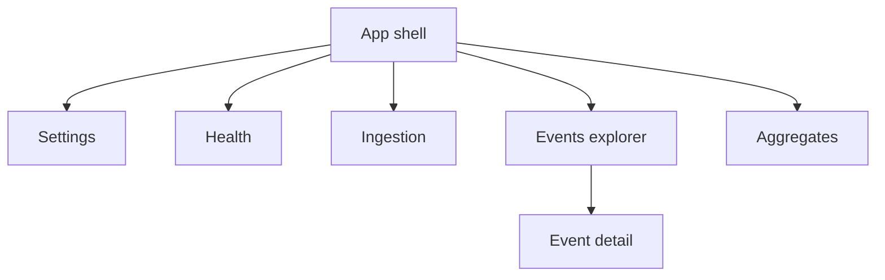

# Frontend MVP Plan

## 1. Objective

Deliver a minimal but practical frontend in a new [`frontend`](frontend) app that makes the current backend capabilities visible and operable end to end, without expanding backend scope.

Success means a developer or tester can use UI screens and controls to exercise all implemented API behaviors from:
- [`health routes`](src/event_platform/api/routes/health.py:13)
- [`ingestion routes`](src/event_platform/api/routes/ingestion.py:26)
- [`events routes`](src/event_platform/api/routes/events.py:16)
- [`aggregates routes`](src/event_platform/api/routes/aggregates.py:21)

## 2. Goals and non-goals

### 2.1 Goals

- Provide a working UI for health, single and batch ingestion, event querying, event detail, and aggregate reads.
- Cover tenant auth flow via `X-Ingest-Key` used by [`get_authenticated_tenant()`](src/event_platform/api/dependencies.py:24).
- Surface current backend response semantics, including duplicates and aggregate `data_source` values from [`AggregateCountResponse`](src/event_platform/api/schemas/aggregates.py:10).
- Keep the implementation simple enough to execute as a standalone frontend MVP foundation.

### 2.2 Non-goals

- No redesign of backend contracts or auth model in [`api dependencies`](src/event_platform/api/dependencies.py:1).
- No frontend role-based auth, user accounts, or token exchange.
- No advanced charting platform, design system rollout, or pixel-perfect UI pass.
- No support for future endpoint ideas not already wired in [`main app routing`](src/event_platform/main.py:24).

## 3. Capability to UI mapping

| Backend capability | Endpoint | Frontend screen | UI control | Expected behavior in UI |
|---|---|---|---|---|
| Liveness check | `GET /health/live` | Health | Live check button | Shows `status=ok` or request failure |
| Readiness check | `GET /health/ready` | Health | Ready check button | Shows ready payload or 503 detail with dependency states |
| Single ingest | `POST /v1/ingest/events` | Ingestion | Event form submit | Displays accepted or duplicate result with `event_id` and duplicate reason |
| Batch ingest | `POST /v1/ingest/events:batch` | Ingestion | Batch JSON textarea submit | Displays total, accepted, duplicate counts and per-item results |
| Event list | `GET /v1/events` | Events Explorer | Filters + search button | Lists tenant-scoped events with pagination cursor |
| Cursor pagination | `GET /v1/events` with `cursor` | Events Explorer | Next page button | Fetches next page using returned `next_cursor` |
| Event detail | `GET /v1/events/{event_id}` | Event Detail drawer/page | Click event row | Loads full event projection, handles 404 and validation errors |
| Aggregate count | `GET /v1/aggregates/count` | Aggregates | Query form submit | Shows count and `data_source` |
| Top event types | `GET /v1/aggregates/top-event-types` | Aggregates | Query form submit with limit | Shows ordered bucket list and `data_source` |
| Top URLs | `GET /v1/aggregates/top-urls` | Aggregates | Query form submit with limit | Shows ordered URL-host bucket list and `data_source` |
| Unique users | `GET /v1/aggregates/unique-users` | Aggregates | Query form submit | Shows unique user count and `data_source=direct_query` |

## 4. Proposed minimal tech stack and rationale

Primary stack for new app under [`frontend`](frontend):
- React + TypeScript with Vite for fast local iteration and typed API usage.
- React Router for page-level navigation between health, ingestion, events, and aggregates.
- TanStack Query for request lifecycle management, caching, loading and error states.
- Zod for form input validation aligned with backend constraints from [`ingestion schemas`](src/event_platform/api/schemas/ingestion.py:12).
- Lightweight UI primitives and basic CSS only, avoiding heavy component framework in MVP.

Rationale:
- Type safety reduces integration mistakes across many query params and response envelopes.
- Query tooling keeps async state explicit for reliability and quick troubleshooting.
- Minimal dependency footprint keeps implementation and maintenance cost low.

## 5. Information architecture and page structure

Top-level routes:
- `/health`
- `/ingestion`
- `/events`
- `/aggregates`
- `/settings` for API base URL and ingest key configuration

Global shell:
- Header with app title and environment badge.
- Left nav with pages.
- Shared request status area for latest API error summary.

## 6. Core user flows

### 6.1 Ingest events

1. User enters API base URL and ingest key in Settings.
2. User opens Ingestion page and chooses Single or Batch mode.
3. UI validates required fields before submit.
4. UI sends request with `X-Ingest-Key` header.
5. UI shows result:
   - single: `accepted` or `duplicate` with reason
   - batch: count summary and per-event status table
6. Optional follow-up action links to Events Explorer with recent filters.

### 6.2 View and query events

1. User opens Events Explorer.
2. User sets filters such as time bounds, event type, source, ingest status, geo country, bot flag.
3. UI requests first page from `/v1/events`.
4. User clicks Next page to use `next_cursor`.
5. User clicks a row to load `/v1/events/{event_id}` detail panel.

### 6.3 View aggregates and rollups

1. User opens Aggregates page.
2. User sets required time window and optional filters.
3. UI queries count, top event types, top URLs, unique users.
4. UI presents metrics and `data_source` badges so rollup vs direct query is visible.

### 6.4 Health and status

1. User opens Health page.
2. UI can run Live and Ready checks independently.
3. UI displays dependency map returned by readiness and highlights degraded services.

## 7. API integration strategy

### 7.1 Client layer

Create a single API client module in [`frontend`](frontend) with:
- shared `fetchJson` wrapper
- typed request and response interfaces
- centralized error normalization from backend `detail`
- per-domain clients: health, ingestion, events, aggregates

### 7.2 Auth and API key handling

- Use ingest key input in Settings and attach as `X-Ingest-Key` on every protected request.
- Store key in `sessionStorage` for MVP, with clear reset control.
- Never render key value in logs, toast bodies, or history panels.
- Health endpoints can be called without key, but frontend may still send key harmlessly.

### 7.3 Environment config

- `VITE_API_BASE_URL` default `http://localhost:8000`.
- Runtime setting in UI can override env value for local testing.
- Keep CORS assumptions explicit in frontend README section if backend origin differs.

## 8. Validation, loading, error, and empty states

Validation coverage:
- Ingestion form requires `event_type` and `occurred_at`, enforces basic length constraints mirroring [`IngestEventRequest`](src/event_platform/api/schemas/ingestion.py:12).
- Batch input requires non-empty events array and max guardrails in UI.
- Events and aggregate filters validate time window ordering before request.
- Aggregates require at least one time bound in UI to match backend behavior in [`_require_time_bound()`](src/event_platform/api/routes/aggregates.py:25).

Loading and async states:
- Per-panel loading indicators for each query.
- Disabled submit buttons during in-flight requests.
- Skeleton rows for events list and aggregate cards.

Error states:
- Inline error blocks for 401, 422, 404, 500 with backend message passthrough.
- Distinct display for readiness 503 payload dependency details.
- Retry actions on transient failures.

Empty states:
- No events found for selected filters.
- No aggregate buckets returned.
- No ingestion attempts yet.

## 9. Local development and deployment plan MVP

Local dev:
- Add `frontend` app with `npm install`, `npm run dev` on port 5173.
- Backend remains on port 8000 from existing quickstart in [`README`](README.md:22).
- Configure `VITE_API_BASE_URL` and ingest key from Settings screen.

MVP deployment approach:
- Build static assets using `npm run build`.
- Serve built frontend as independent static site.
- Configure backend API URL via env at build time.
- Keep frontend and backend deploy pipelines decoupled for simplicity.

## 10. Incremental implementation phases and acceptance criteria

### Phase 1: Frontend scaffold and shared infrastructure

Scope:
- Create React Vite TypeScript project structure in [`frontend`](frontend).
- Add router, layout shell, settings store, typed API client base.

Acceptance criteria:
- App runs locally and navigates between placeholder pages.
- Settings page persists API base URL and ingest key in session storage.
- Shared client injects `X-Ingest-Key` and normalizes errors.

### Phase 2: Health and ingestion pages

Scope:
- Implement Health page for live and ready checks.
- Implement Single and Batch ingestion forms and result panels.

Acceptance criteria:
- Live and ready checks display payloads and degraded dependency states.
- Single ingest returns visible accepted or duplicate outcomes.
- Batch ingest shows totals and per-item statuses.

### Phase 3: Events explorer and detail

Scope:
- Implement events filter form, table, cursor pagination, and detail drawer.

Acceptance criteria:
- Query supports implemented filters from [`list_events()`](src/event_platform/api/routes/events.py:20).
- Next page uses cursor and appends or replaces table correctly.
- Clicking event row loads detail from [`get_event_detail()`](src/event_platform/api/routes/events.py:73).

### Phase 4: Aggregates dashboard

Scope:
- Implement aggregate query form and cards/tables for four aggregate endpoints.

Acceptance criteria:
- Count, top event types, top URLs, unique users all callable from UI.
- `data_source` is rendered for each response.
- Validation prevents invalid windows before request and displays backend 422 when returned.

### Phase 5: Hardening and MVP handoff

Scope:
- Improve empty states, retries, and basic usability polish.
- Add frontend README instructions and endpoint coverage checklist.

Acceptance criteria:
- Manual smoke walkthrough covers all mapped capabilities.
- MVP frontend can reproduce expected core behaviors from [`integration tests`](tests/integration).

## 11. Risks and mitigations

- Risk: Backend validation complexity causes confusing form errors.
  - Mitigation: mirror key constraints client-side and surface backend `detail.message` exactly.

- Risk: Ingest key mishandling leaks sensitive values.
  - Mitigation: mask key display, keep in session scope, prevent logging of headers.

- Risk: Aggregates may return different `data_source` values based on coverage.
  - Mitigation: always display source badges and avoid assuming rollup availability.

- Risk: CORS or origin mismatch blocks local integration.
  - Mitigation: document local origin expectations and include configurable API base URL.

## 12. Done definition for frontend MVP planning

This plan is complete when implementation can deliver a frontend that exercises all currently implemented backend APIs in [`health routes`](src/event_platform/api/routes/health.py:13), [`ingestion routes`](src/event_platform/api/routes/ingestion.py:26), [`events routes`](src/event_platform/api/routes/events.py:16), and [`aggregates routes`](src/event_platform/api/routes/aggregates.py:21), with explicit UX coverage for success, validation error, and empty-state paths.

## 13. Architecture and scalability review for near-term MVP growth

Review target:
- Small team ownership
- Moderate traffic
- Simple operations

### 13.1 What is architecturally strong already

- Clear separation of concerns using route-driven pages and a shared API client keeps complexity bounded.
- Typed contracts plus validation strategy reduce drift risk between frontend and backend.
- Explicit loading, error, and empty states improve operational clarity for testers.
- Phase-based implementation with endpoint coverage criteria supports reliable incremental delivery.

### 13.2 Key gaps and risks for near-term scale

1. Over-fetch and cache ambiguity risk
   - Current plan names TanStack Query but does not define cache keys, stale times, or invalidation rules.
   - Risk: duplicate requests, stale results confusion, and unnecessary backend pressure under moderate use.

2. Settings and secret handling risk
   - `sessionStorage` is acceptable for MVP but key lifecycle behavior is under-specified.
   - Risk: accidental key reuse across environments and harder troubleshooting for auth failures.

3. Missing client-side observability baseline
   - No minimum telemetry/logging contract for request failures.
   - Risk: team cannot quickly diagnose field issues without reproducing locally.

4. UX consistency risk across pages
   - Error/empty/loading behavior is described, but not normalized by reusable UI components.
   - Risk: inconsistent behavior, rising maintenance overhead, and regressions as pages expand.

5. Deployment runtime configuration rigidity
   - Build-time env is covered; runtime config fallback is only partially defined.
   - Risk: environment promotion friction when API origins differ.

### 13.3 Recommended low-complexity architecture adjustments

Priority A: Define query policy in architecture baseline
- Add a short query policy matrix in implementation docs:
  - Health: no cache or very short stale window
  - Events and aggregates: key by full filter payload, conservative stale window
  - Event detail: key by event id
- Add explicit invalidation points after successful ingest to refresh events and aggregate widgets.

Priority A: Introduce a thin frontend module structure
- Suggested folders inside [`frontend`](frontend):
  - `src/app` shell, routing, providers
  - `src/features/health`
  - `src/features/ingestion`
  - `src/features/events`
  - `src/features/aggregates`
  - `src/shared/api`, `src/shared/ui`, `src/shared/lib`
- Keep domain logic in feature modules and cross-cutting utilities in shared modules.

Priority B: Add an API error contract mapper
- Normalize backend `detail` payloads into a small frontend error model.
- Add user-safe messages and a debug payload view toggle for local dev only.

Priority B: Standardize state components
- Create shared primitives for loading panel, empty result, and error block.
- Use these across all pages to reduce duplicate behavior and simplify testing.

Priority B: Tighten settings model
- Persist `apiBaseUrl` and key separately with clear environment label.
- Add one-click clear/reset and key masking by default.
- Add explicit warning banner when key is absent for protected endpoints.

Priority C: Add minimal observability
- Include request id passthrough display when available.
- Add optional lightweight client logging hook for failed requests in dev mode.
- Define a support bundle view with last N request summaries for debugging.

### 13.4 Suggested acceptance criteria additions

- Query behavior is deterministic:
  - repeated identical filters do not trigger duplicate network calls within stale window
  - ingest success triggers targeted invalidation for events and aggregate widgets
- Error semantics are consistent:
  - same backend error class renders same UI pattern across pages
- Settings safety is verified:
  - key is masked in UI and never rendered in logs or persisted exports
- Operability baseline exists:
  - developers can inspect failed request summaries without browser devtools

### 13.5 Scalability verdict

The current plan is a solid MVP foundation for near-term growth. With the adjustments above, it remains lightweight while improving maintainability, predictable data behavior, and operational support for a small team handling moderate traffic.
