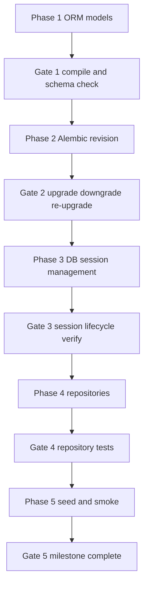

# Milestone 2 Plan: Data Model and Migrations

## Outcome target

Milestone 2 is complete when:

- Base relational schema for tenant, ingestion key, raw event, normalized event exists in PostgreSQL
- Migration lifecycle works both directions
- Database session management is wired and reusable by services
- Repository abstractions are usable by Milestone 3 ingestion logic
- Seed path creates one tenant and one ingestion key for local development

## Priority model

This plan is structured around delivery checkpoints. Each phase ends with:

1. Runnable verification command
2. Explicit acceptance criteria
3. Go or no-go gate for next phase

No phase advances without passing its gate.

---

## Phase 1: ORM model foundation

### Scope

- Create SQLAlchemy declarative base and shared mixins
- Implement models for:
  - `tenant`
  - `ingestion_key`
  - `event_raw`
  - `event_normalized`
- Encode key constraints and index metadata in model definitions

### Files to create or update

- [`src/event_platform/infrastructure/db/base.py`](src/event_platform/infrastructure/db/base.py)
- [`src/event_platform/infrastructure/db/models.py`](src/event_platform/infrastructure/db/models.py)

### Verification command

```bash
python -m compileall src
```

### Acceptance criteria

- All model modules compile with no syntax errors
- Table names, PKs, FKs, and index intent match milestone requirements
- `event_normalized.event_id` is defined as PK and FK to raw event

### Gate

- Go only if model structure is stable and migration-ready

---

## Phase 2: Alembic integration and first revision

### Scope

- Wire SQLAlchemy metadata into Alembic environment
- Create first migration revision for all four core tables
- Add constraints and indexes, including partial unique idempotency index
- Ensure downgrade reverses all objects cleanly

### Files to create or update

- [`alembic/env.py`](alembic/env.py)
- [`alembic/versions/<revision>_core_tables.py`](alembic/versions/)

### Verification commands

```bash
alembic upgrade head
alembic downgrade base
alembic upgrade head
```

### Acceptance criteria

- Upgrade succeeds on empty database
- Downgrade succeeds without orphan objects
- Re-upgrade succeeds after downgrade
- All expected tables and indexes exist after final upgrade

### Gate

- Go only if migration cycle is repeatable and reversible

---

## Phase 3: DB session and transaction management

### Scope

- Build SQLAlchemy engine and session factory
- Add context-managed session lifecycle helper
- Add transaction helper for commit or rollback boundaries

### Files to create or update

- [`src/event_platform/infrastructure/db/session.py`](src/event_platform/infrastructure/db/session.py)

### Verification command

```bash
python -c "from event_platform.infrastructure.db.session import SessionLocal; s = SessionLocal(); s.close(); print('ok')"
```

### Acceptance criteria

- Session factory instantiates and closes cleanly
- Transaction helper guarantees rollback on exception
- Design is reusable for API dependencies and command paths

### Gate

- Go only if session lifecycle is deterministic and safe

---

## Phase 4: Repository abstractions and implementations

### Scope

- Define repository contracts for tenant, key, raw event, normalized event
- Implement SQLAlchemy repositories with focused CRUD and lookup methods
- Keep service layer decoupled from ORM internals

### Files to create or update

- [`src/event_platform/infrastructure/repositories/tenants_repo.py`](src/event_platform/infrastructure/repositories/tenants_repo.py)
- [`src/event_platform/infrastructure/repositories/keys_repo.py`](src/event_platform/infrastructure/repositories/keys_repo.py)
- [`src/event_platform/infrastructure/repositories/events_repo.py`](src/event_platform/infrastructure/repositories/events_repo.py)

### Verification command

```bash
pytest -q tests/integration/test_repositories.py
```

### Acceptance criteria

- Repository create and lookup paths work against migrated schema
- Idempotency lookup methods exist for both key and dedupe strategies
- Repository tests pass on clean database

### Gate

- Go only if repository layer supports Milestone 3 ingestion needs without direct ORM calls

---

## Phase 5: Seed workflow and milestone validation

### Scope

- Add deterministic seed routine for one demo tenant and one active ingestion key
- Persist key hash and prefix only
- Provide local command for migration plus seeding bootstrap

### Files to create or update

- [`src/event_platform/infrastructure/db/seed.py`](src/event_platform/infrastructure/db/seed.py)
- [`README.md`](README.md)

### Verification commands

```bash
alembic upgrade head
python -m event_platform.infrastructure.db.seed
pytest -q tests/integration/test_migration_smoke.py tests/integration/test_seed.py
```

### Acceptance criteria

- Seed command inserts tenant and key data exactly once or idempotently updates expected records
- Key secret handling never stores plaintext key
- Migration smoke and seed tests pass

### Gate

- Milestone complete only when all Phase 1 through Phase 5 gates are passed

---

## Data model baseline for this milestone

### `tenant`

- `id` UUID PK
- `name` VARCHAR unique not null
- `status` VARCHAR not null default active
- `created_at` TIMESTAMPTZ not null default now

### `ingestion_key`

- `id` UUID PK
- `tenant_id` UUID FK not null
- `key_prefix` VARCHAR unique not null
- `key_hash` VARCHAR not null
- `is_active` BOOLEAN not null default true
- `last_used_at` TIMESTAMPTZ nullable
- `created_at` TIMESTAMPTZ not null default now

### `event_raw`

- `id` UUID PK
- `tenant_id` UUID FK not null
- `source` VARCHAR not null
- `event_type_original` VARCHAR not null
- `occurred_at_original` TIMESTAMPTZ not null
- `received_at` TIMESTAMPTZ not null default now
- `payload_jsonb` JSONB not null
- `headers_jsonb` JSONB not null default empty object
- `ip` VARCHAR nullable
- `user_agent` TEXT nullable
- `idempotency_key` VARCHAR nullable
- `dedupe_hash` VARCHAR not null
- `schema_version` VARCHAR nullable
- `ingest_status` VARCHAR not null default accepted

Indexes and constraints:

- Index on `tenant_id, received_at`
- Index on `tenant_id, event_type_original`
- Partial unique index on `tenant_id, idempotency_key` where key is not null
- Index on `tenant_id, dedupe_hash`

### `event_normalized`

- `event_id` UUID PK and FK to `event_raw.id`
- `tenant_id` UUID FK not null
- `event_type_canonical` VARCHAR not null
- `occurred_at_utc` TIMESTAMPTZ not null
- `user_id` VARCHAR nullable
- `session_id` VARCHAR nullable
- `severity` VARCHAR nullable
- `url` TEXT nullable
- `referrer` TEXT nullable
- `source` VARCHAR not null
- `ingestion_date` DATE not null

Indexes:

- Index on `tenant_id, occurred_at_utc`
- Index on `tenant_id, event_type_canonical, occurred_at_utc`
- Index on `tenant_id, user_id, occurred_at_utc`

---

## Execution todo list for implementation mode

- [ ] Phase 1 complete with compile verification
- [ ] Phase 2 complete with upgrade downgrade re-upgrade cycle
- [ ] Phase 3 complete with session lifecycle verification
- [ ] Phase 4 complete with repository integration tests
- [ ] Phase 5 complete with seed and smoke validation tests

---

## Delivery flow diagram



