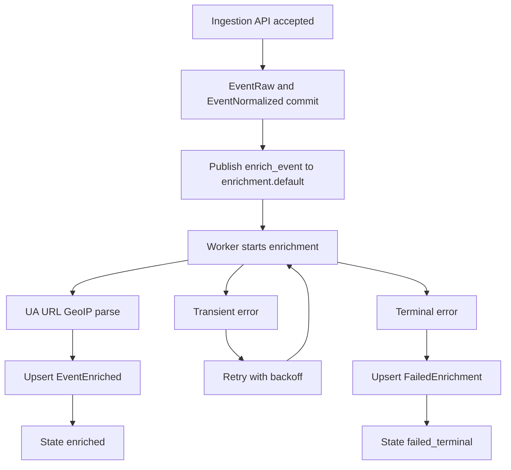

# Milestone 4: Enrichment Worker Pipeline Plan

## 1. Milestone objective

Deliver an execution-ready async enrichment pipeline so accepted events are enriched by a Celery worker after ingestion commit, with retries and durable failure records.

Working increment for Milestone 4:
- Events accepted by [`ingest_event()`](src/event_platform/api/routes/ingestion.py:34) and [`ingest_events_batch()`](src/event_platform/api/routes/ingestion.py:64) are queued to `enrichment.default`.
- Worker task in [`enrich_event()`](src/event_platform/worker/tasks/enrichment.py:13) performs baseline UA/URL/GeoIP enrichment and writes results idempotently.
- Retryable and terminal failures are persisted for operational visibility.

## 2. Non-goals

- No new query API surfaces beyond current Milestone 3 routes.
- No aggregate endpoint implementation from Milestone 5.
- No advanced risk-scoring or anomaly engine.
- No distributed tracing rollout beyond structured logs and baseline metrics.

## 3. Current baseline and implementation anchors

- Celery wiring exists in [`celery_app`](src/event_platform/worker/celery_app.py:9).
- Placeholder enrichment task exists in [`enrich_event()`](src/event_platform/worker/tasks/enrichment.py:13).
- Ingestion persistence and dedupe live in [`IngestionService.ingest_event()`](src/event_platform/application/ingestion_service.py:31).
- API transaction boundaries are in [`ingest_event()`](src/event_platform/api/routes/ingestion.py:34) and [`ingest_events_batch()`](src/event_platform/api/routes/ingestion.py:64).
- Existing persistence models are in [`EventRaw`](src/event_platform/infrastructure/db/models.py:46) and [`EventNormalized`](src/event_platform/infrastructure/db/models.py:93).
- Worker runtime container already exists in [`docker-compose.yml`](docker-compose.yml).

## 4. Architecture additions for async enrichment

### 4.1 Pipeline shape

1. API writes raw and normalized event rows in one transaction.
2. After successful commit, accepted `event_id` values are published to Celery queue `enrichment.default`.
3. Worker consumes each `event_id`, loads source data, computes enrichment fields, and writes projection.
4. On transient failure, task retries with backoff.
5. On terminal failure, failure row is upserted in failed enrichment persistence.

### 4.2 Module additions and edits

- Extend [`src/event_platform/core/config.py`](src/event_platform/core/config.py) with worker-enrichment settings.
- Replace placeholder logic in [`src/event_platform/worker/tasks/enrichment.py`](src/event_platform/worker/tasks/enrichment.py) with real orchestration.
- Add application orchestration service at [`src/event_platform/application/enrichment_service.py`](src/event_platform/application/enrichment_service.py).
- Add parser adapters:
  - [`src/event_platform/infrastructure/enrichment/user_agent.py`](src/event_platform/infrastructure/enrichment/user_agent.py)
  - [`src/event_platform/infrastructure/enrichment/url_parser.py`](src/event_platform/infrastructure/enrichment/url_parser.py)
  - [`src/event_platform/infrastructure/enrichment/geoip.py`](src/event_platform/infrastructure/enrichment/geoip.py)
- Extend repositories in [`src/event_platform/infrastructure/repositories/events_repo.py`](src/event_platform/infrastructure/repositories/events_repo.py) for enriched and failed enrichment upserts.
- Update ingestion route flow in [`src/event_platform/api/routes/ingestion.py`](src/event_platform/api/routes/ingestion.py) to enqueue accepted events post-commit.

### 4.3 Flow diagram

## 5. Data model changes

## 5.1 New table: `event_enriched`

Purpose: idempotent enrichment projection keyed by `event_id`.

Proposed columns:
- `event_id` UUID PK FK `event_raw.id`
- `tenant_id` UUID FK `tenant.id`
- `geo_country` varchar
- `ua_browser` varchar
- `ua_os` varchar
- `ua_device` varchar
- `url_host` varchar
- `url_path` text
- `referrer_domain` varchar
- `is_bot` boolean default `false`
- `schema_tag` varchar default `m4_baseline`
- `enriched_at` timestamptz default `now()`

Indexes:
- `(tenant_id, enriched_at)`
- `(tenant_id, geo_country)`
- `(tenant_id, is_bot)`
- `(tenant_id, url_host)`

## 5.2 New table: `failed_enrichment`

Purpose: durable failure visibility for retry exhausted and non-retryable errors.

Proposed columns:
- `id` UUID PK
- `event_id` UUID unique FK `event_raw.id`
- `tenant_id` UUID FK `tenant.id`
- `stage` varchar
- `error_code` varchar
- `error_message` text
- `attempts` int
- `failed_at` timestamptz
- `next_retry_at` timestamptz nullable
- `status` varchar values `retrying` or `terminal`
- `last_task_id` varchar nullable

Indexes:
- `(tenant_id, status, failed_at)`
- `(event_id)` unique

## 5.3 Existing table extension

Extend [`EventRaw`](src/event_platform/infrastructure/db/models.py:46) to track lifecycle via existing `ingest_status` field values:
- `accepted`
- `queued`
- `enriching`
- `enriched`
- `failed_terminal`

Notes:
- Reuse `ingest_status` to avoid introducing parallel state columns in Milestone 4.
- Keep state transitions in worker and enqueue boundary only.

## 5.4 Migration artifacts

- Add Alembic revision under [`alembic/versions/`](alembic/versions/) to create `event_enriched` and `failed_enrichment`, indexes, and status constraints.
- Update ORM mappings in [`src/event_platform/infrastructure/db/models.py`](src/event_platform/infrastructure/db/models.py).

## 6. Celery task topology, retry, and idempotency

## 6.1 Task topology

Primary task:
- `event_platform.enrich_event`
- queue: `enrichment.default`
- payload: `event_id` only

Execution steps inside task:
1. Load raw and normalized rows by `event_id`.
2. Mark state `enriching`.
3. Execute stage parsers UA then URL then GeoIP.
4. Upsert `event_enriched`.
5. Mark state `enriched` and clear prior failed record if present.

## 6.2 Retry and backoff policy

Use Celery options on [`enrich_event()`](src/event_platform/worker/tasks/enrichment.py:13):
- `autoretry_for`: transient infra errors only
- `max_retries`: `5`
- `retry_backoff`: `2`
- `retry_backoff_max`: `300`
- `retry_jitter`: enabled
- `acks_late`: enabled for at-least-once delivery

Error classes:
- Retryable: Redis transient failure, DB connection drop, GeoIP DB read temporary I O errors.
- Non-retryable: malformed event shape after persistence, unsupported parser input types.

On each failure attempt:
- update or create `failed_enrichment` with latest attempt count and projected `next_retry_at`.
- on final attempt exhaustion, set `status=terminal` and update raw lifecycle to `failed_terminal`.

## 6.3 Idempotency strategy

- Task identity is `event_id`; all writes keyed by `event_id`.
- `event_enriched` write uses upsert semantics so duplicate deliveries do not duplicate rows.
- If an `event_enriched` row already exists with `schema_tag=m4_baseline`, task exits as no-op success.
- `failed_enrichment` is unique per event and updated in place.
- API enqueue only for newly accepted events, never for duplicate outcomes from [`IngestionService.ingest_event()`](src/event_platform/application/ingestion_service.py:31).

## 7. Parser integration strategy

Locked baseline dependencies:
- UA parser: `ua-parser`
- URL parser: Python `urllib.parse` plus `tldextract`
- GeoIP parser: `maxminddb` with GeoLite2 country DB

Integration details:
- Add parser adapters in infrastructure layer with pure function style interfaces.
- Parser adapters must return normalized output structs with nullable fields, not raise for missing optional input.
- Only true infrastructure faults raise retryable errors.
- Parse anomalies from client data become nullable outputs plus warning logs.

Configuration additions in [`Settings`](src/event_platform/core/config.py:8):
- `celery_enrichment_queue` default `enrichment.default`
- `enrichment_max_retries` default `5`
- `enrichment_backoff_base_seconds` default `2`
- `geoip_db_path` default mounted path under container

Dependency additions in [`pyproject.toml`](pyproject.toml):
- `ua-parser`
- `tldextract`
- `maxminddb`

## 8. API and worker interaction flow with lifecycle states

## 8.1 Single event flow

1. API receives event and validates payload.
2. Service persists raw and normalized rows in transaction.
3. If status is `accepted`, enqueue `event_platform.enrich_event` after commit.
4. Set raw state to `queued` immediately after successful publish.
5. Worker sets `enriching` on start.
6. On success write `event_enriched` then set raw state `enriched`.
7. On terminal failure write `failed_enrichment` and set raw state `failed_terminal`.

## 8.2 Batch flow

- Perform same steps per accepted event in returned batch results.
- Dispatch tasks in bounded loop after transaction commit.
- Log publish failures with `event_id` and persist failure with stage `publish` when enqueue fails.

## 9. Observability requirements

## 9.1 Structured logs

Worker logs must include:
- `event_id`
- `tenant_id`
- `task_id`
- `queue`
- `attempt`
- `stage`
- `lifecycle_state`
- `error_code` for failures

Required log events:
- `enrichment_task_received`
- `enrichment_stage_completed`
- `enrichment_retry_scheduled`
- `enrichment_terminal_failure`
- `enrichment_completed`

## 9.2 Metrics

Expose or emit at least these counters and timing signals:
- `enrichment_tasks_started_total`
- `enrichment_tasks_succeeded_total`
- `enrichment_tasks_failed_total`
- `enrichment_retries_total`
- `enrichment_duration_ms`

Milestone 4 minimum is log-correlated metric output; exporter hardening can continue in Milestone 6.

## 9.3 Failure visibility

- Terminal failures queryable directly in `failed_enrichment` table.
- Worker startup should log parser dependency readiness and GeoIP DB path status.
- Add simple operational runbook notes in plan output and README follow-up.

## 10. Delivery phases, gates, verification, acceptance

## Phase 1: Schema and model groundwork

Scope:
- Add migration and ORM models for `event_enriched` and `failed_enrichment`.
- Extend raw lifecycle states.

Checkpoint gate:
- Migration applies and downgrades cleanly.

Verification commands:
- `alembic upgrade head`
- `alembic downgrade -1`
- `alembic upgrade head`

Acceptance criteria:
- New tables and indexes exist.
- ORM imports succeed.

## Phase 2: Worker orchestration and enqueue boundary

Scope:
- Implement post-commit enqueue in ingestion routes.
- Implement task orchestration path and state transitions.

Checkpoint gate:
- Accepted events produce Celery tasks on `enrichment.default`.

Verification commands:
- `docker compose up -d --build`
- `docker compose logs worker --tail=200`
- `pytest -q tests/integration/test_ingestion_api.py`

Acceptance criteria:
- Duplicate events are not enqueued.
- Accepted events transition from `accepted` to `queued` to `enriching`.

## Phase 3: Parser integrations and enriched projection

Scope:
- Implement UA URL GeoIP adapters.
- Implement enriched row upsert writes.

Checkpoint gate:
- Worker writes `event_enriched` for valid events.

Verification commands:
- `pytest -q tests/worker/test_enrichment_tasks.py`
- `pytest -q tests/integration -k ingest`

Acceptance criteria:
- Enriched fields are populated when source data exists.
- Missing user agent or URL or IP yields nullable fields without task crash.

## Phase 4: Retry and failed enrichment persistence

Scope:
- Differentiate retryable vs non-retryable errors.
- Persist retries and terminal failures in `failed_enrichment`.

Checkpoint gate:
- Forced transient failure retries then succeeds.
- Forced hard failure ends terminal with persisted failure row.

Verification commands:
- `pytest -q tests/worker/test_enrichment_tasks.py -k retry`
- `pytest -q tests/integration -k failure`

Acceptance criteria:
- Retry counters and `next_retry_at` are stored.
- Terminal failures set raw lifecycle to `failed_terminal`.

## Phase 5: Observability and readiness polish

Scope:
- Add structured log events and baseline metrics emission.
- Confirm container level behavior and operator visibility.

Checkpoint gate:
- Logs and metrics clearly expose success retry and failure paths.

Verification commands:
- `docker compose logs api --tail=200`
- `docker compose logs worker --tail=200`
- `pytest -q`

Acceptance criteria:
- Required log keys appear on all task paths.
- End to end flow from ingest to enriched is reproducible locally.

## 11. Risks and mitigations

| Risk | Impact | Mitigation |
| --- | --- | --- |
| Queue publish after DB commit can fail and leave accepted but unqueued events | Enrichment gap | Persist failure at stage `publish` in `failed_enrichment` and log for replay tooling later |
| GeoIP database missing or stale | Partial enrichment loss | Startup readiness log with explicit DB path and fallback to nullable geo fields |
| At least once delivery causes duplicate execution | Duplicate writes | Upsert by `event_id` and no-op if `schema_tag` already current |
| Parser variability on malformed UA URL inputs | High noise failures | Treat malformed client input as nullable parse output, not retryable exception |
| Tight coupling to one queue | Operational inflexibility | Keep queue in config via `celery_enrichment_queue` setting |

## 12. Handoff criteria to Milestone 5

Milestone 4 is complete and ready for Milestone 5 when all are true:

- Async enrichment is triggered for all newly accepted events from ingestion routes.
- `event_enriched` is populated idempotently and linked to `event_raw`.
- `failed_enrichment` captures retry and terminal outcomes with actionable metadata.
- Lifecycle states are reliably transitioned and visible.
- Test coverage exists for success, duplicate no-enqueue, retry, and terminal failure paths.
- Query planning for Milestone 5 can safely rely on enriched fields and failure status data.

---

Implementation traceability summary:
- Existing foundations: [`src/event_platform/worker/celery_app.py`](src/event_platform/worker/celery_app.py), [`src/event_platform/worker/tasks/enrichment.py`](src/event_platform/worker/tasks/enrichment.py), [`src/event_platform/application/ingestion_service.py`](src/event_platform/application/ingestion_service.py), [`src/event_platform/infrastructure/db/models.py`](src/event_platform/infrastructure/db/models.py)
- Milestone 4 target artifact: [`plans/milestone-4-enrichment-worker-plan.md`](plans/milestone-4-enrichment-worker-plan.md)
