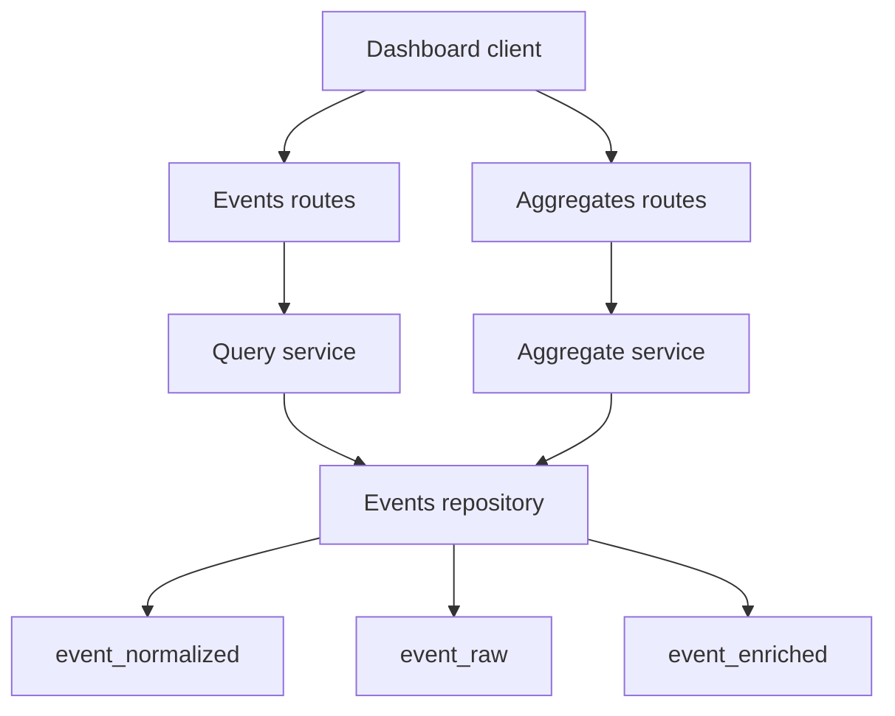

# Milestone 5: Query and Aggregates Plan

## 1. Milestone objective

Deliver dashboard-ready read APIs by extending tenant-scoped querying with stable cursor pagination and adding aggregate endpoints backed by indexed queries across normalized and enriched event data.

Milestone 5 working increment:
- Filtered event list API with deterministic cursor paging.
- Event detail API for a single event read model.
- Aggregate endpoints for count, top event types, top URLs, and unique users.
- Direct indexed aggregate queries now, with an explicit rollup evolution path.

## 2. Non-goals

- No ingestion write-path redesign from [`IngestionService.ingest_event()`](src/event_platform/application/ingestion_service.py:31).
- No Milestone 4 enrichment pipeline redesign.
- No full materialized aggregation pipeline in this milestone.
- No auth expansion beyond tenant-scoped key flow in [`get_authenticated_tenant()`](src/event_platform/api/dependencies.py:24).
- No observability exporter rollout beyond read-path logging and metric hooks.

## 3. Upstream dependency context from Milestone 4

Milestone 5 assumes handoff conditions from [`plans/milestone-4-enrichment-worker-plan.md`](plans/milestone-4-enrichment-worker-plan.md):
- Idempotent, queryable enrichment in [`EventEnriched`](src/event_platform/infrastructure/db/models.py:138).
- Enrichment failure visibility in [`FailedEnrichment`](src/event_platform/infrastructure/db/models.py:177).
- Event lifecycle state in [`EventRaw.ingest_status`](src/event_platform/infrastructure/db/models.py:88).

## 4. Current baseline and implementation anchors

- Read service baseline: [`QueryService.list_events()`](src/event_platform/application/query_service.py:15).
- Route baseline: [`list_events()`](src/event_platform/api/routes/events.py:17).
- Schema baseline: [`EventListItem`](src/event_platform/api/schemas/events.py:11), [`EventListResponse`](src/event_platform/api/schemas/events.py:34).
- Repository baseline: [`EventRawRepository.list_with_normalized()`](src/event_platform/infrastructure/repositories/events_repo.py:68).
- Storage/index anchors: [`EventRaw`](src/event_platform/infrastructure/db/models.py:46), [`EventNormalized`](src/event_platform/infrastructure/db/models.py:95), [`EventEnriched`](src/event_platform/infrastructure/db/models.py:138).
- App wiring baseline: [`create_app()`](src/event_platform/main.py:12).

Current gaps:
- Basic list endpoint only.
- No detail endpoint.
- No aggregate endpoints.
- No cursor contract or full filter contract.

## 5. Architecture additions for query and aggregates read path

### 5.1 Target read path

### 5.2 Layer responsibilities

- API
  - Extend [`src/event_platform/api/routes/events.py`](src/event_platform/api/routes/events.py) for filters, cursor IO, and detail.
  - Add [`src/event_platform/api/routes/aggregates.py`](src/event_platform/api/routes/aggregates.py).
- Application
  - Refactor [`src/event_platform/application/query_service.py`](src/event_platform/application/query_service.py) for cursor paging and detail reads.
  - Add [`src/event_platform/application/aggregate_service.py`](src/event_platform/application/aggregate_service.py).
- Infrastructure
  - Extend [`src/event_platform/infrastructure/repositories/events_repo.py`](src/event_platform/infrastructure/repositories/events_repo.py) with filtered paging and aggregates.
  - Extend indexes in [`src/event_platform/infrastructure/db/models.py`](src/event_platform/infrastructure/db/models.py).

## 6. API surface plan

### 6.1 Event list endpoint

Endpoint: `GET /v1/events`

Query contract:
- `limit` int default `50`, min `1`, max `200`
- `cursor` optional string
- `sort` enum `desc | asc`, default `desc`
- Optional filters: `occurred_from`, `occurred_to`, `event_type`, `severity`, `source`, `user_id`, `session_id`, `ingest_status`, `geo_country`, `is_bot`

Response evolution:
- `items`
- `next_cursor` nullable string
- `has_more` bool
- `count` page item count

### 6.2 Event detail endpoint

Endpoint: `GET /v1/events/{event_id}`

Behavior:
- Tenant-scoped lookup only.
- Returns normalized + enrichment projection and lifecycle state.
- Returns not found when missing in tenant scope.

### 6.3 Aggregate endpoints

- `GET /v1/aggregates/count`
- `GET /v1/aggregates/top-event-types`
- `GET /v1/aggregates/top-urls`
- `GET /v1/aggregates/unique-users`

Common aggregate filters:
- `occurred_from`, `occurred_to`
- Optional `event_type`, `source`, `severity`, `geo_country`, `is_bot`
- `limit` for top-N endpoints, capped

Response direction:
- Include `data_source=direct_query` in Milestone 5 to keep rollup migration explicit.

## 7. Cursor pagination strategy and filter contract

### 7.1 Stable ordering and tiebreaker

- Primary sort key: `event_normalized.occurred_at_utc`.
- Tiebreaker: `event_raw.id`.
- Supported orders: default `desc`, optional `asc`.
- Determinism: always sort by both keys; never paginate by timestamp alone.

### 7.2 Cursor format

Opaque base64url JSON payload with:
- `occurred_at`
- `event_id`
- `sort`
- `filter_hash`

`filter_hash` is computed from active filters excluding `cursor` and `limit`.

Validation:
- Reject cursor if hash mismatches current filters.
- Reject malformed cursor with validation error.

### 7.3 SQL seek predicates

- `desc`: `occurred_at_utc < cursor.occurred_at` OR `occurred_at_utc = cursor.occurred_at AND event_id < cursor.event_id`
- `asc`: `occurred_at_utc > cursor.occurred_at` OR `occurred_at_utc = cursor.occurred_at AND event_id > cursor.event_id`

### 7.4 Filter semantics

- All filters are tenant-scoped and AND-combined.
- Time range applies to normalized occurred timestamp.
- Enrichment filters are left-join-aware:
  - Filter present: require matching enriched row.
  - Filter absent: keep events whether enrichment exists or not.

## 8. Data model, index, and query strategy for performant reads

### 8.1 Query driving table

Drive list and aggregate windows from [`event_normalized`](src/event_platform/infrastructure/db/models.py:98), joined to:
- [`event_raw`](src/event_platform/infrastructure/db/models.py:49) for lifecycle + metadata
- [`event_enriched`](src/event_platform/infrastructure/db/models.py:141) for enrichment dimensions + filters

Rationale: retain time-window selectivity and avoid raw-payload-heavy scans.

### 8.2 Existing useful indexes

- [`ix_event_normalized_tenant_occurred_at`](src/event_platform/infrastructure/db/models.py:100)
- [`ix_event_normalized_tenant_type_occurred_at`](src/event_platform/infrastructure/db/models.py:102)
- [`ix_event_normalized_tenant_user_occurred_at`](src/event_platform/infrastructure/db/models.py:108)
- [`ix_event_enriched_tenant_geo_country`](src/event_platform/infrastructure/db/models.py:144)
- [`ix_event_enriched_tenant_is_bot`](src/event_platform/infrastructure/db/models.py:145)
- [`ix_event_raw_tenant_received_at`](src/event_platform/infrastructure/db/models.py:51)

### 8.3 Milestone 5 index additions

Add migration for read-heavy combinations:
- `event_normalized`: `(tenant_id, source, occurred_at_utc)`
- `event_normalized`: `(tenant_id, severity, occurred_at_utc)`
- `event_normalized`: `(tenant_id, session_id, occurred_at_utc)`
- `event_enriched`: `(tenant_id, geo_country, event_id)`
- `event_enriched`: `(tenant_id, is_bot, event_id)`
- `event_raw`: `(tenant_id, ingest_status, received_at)`

### 8.4 Query-shape guardrails

- Require tenant predicate in every query.
- Enforce bounded `limit` on list and top-N endpoints.
- Require at least one time bound for aggregates to avoid unbounded scans.

## 9. Aggregate computation strategy

### 9.1 Milestone 5 direct-query path

Compute aggregates from indexed tables:
- Count: filtered row count from normalized plus optional joins.
- Top event types: group by `event_type_canonical`.
- Top URLs: group by enriched `url_host`, fallback to normalized host extraction only when needed.
- Unique users: `count(distinct user_id)`, excluding null `user_id`.

### 9.2 Rollup-ready evolution path

Keep Milestone 6+ rollout explicit:
- Optional model + migration placeholder for `aggregate_rollup` buckets.
- Aggregate service interface remains dual-source capable: `direct_query` now, `rollup` later.
- Keep response metadata `data_source` for transparent migration.

No rollup scheduler or compaction job is included in Milestone 5.

## 10. Service, repository, and module change plan

### 10.1 API modules

- Update [`src/event_platform/api/routes/events.py`](src/event_platform/api/routes/events.py)
  - expand list filters
  - add cursor handling
  - add `GET /v1/events/{event_id}`
- Add [`src/event_platform/api/routes/aggregates.py`](src/event_platform/api/routes/aggregates.py)
- Update router wiring in [`src/event_platform/main.py`](src/event_platform/main.py:12)

### 10.2 Schemas

- Extend [`src/event_platform/api/schemas/events.py`](src/event_platform/api/schemas/events.py)
  - pagination envelope
  - cursor fields
  - detail response model
- Add [`src/event_platform/api/schemas/aggregates.py`](src/event_platform/api/schemas/aggregates.py)

### 10.3 Application services

- Refactor [`src/event_platform/application/query_service.py`](src/event_platform/application/query_service.py)
  - filter DTO mapping
  - cursor encode decode
  - list and detail use cases
- Add [`src/event_platform/application/aggregate_service.py`](src/event_platform/application/aggregate_service.py)

### 10.4 Repository methods

Extend [`src/event_platform/infrastructure/repositories/events_repo.py`](src/event_platform/infrastructure/repositories/events_repo.py):
- `list_filtered_page`
- `get_event_detail`
- `count_events`
- `top_event_types`
- `top_urls`
- `unique_users`

### 10.5 DB and migration artifacts

- Update [`src/event_platform/infrastructure/db/models.py`](src/event_platform/infrastructure/db/models.py)
- Add Alembic revision in [`alembic/versions/`](alembic/versions/)

### 10.6 Test modules

- Add [`tests/integration/test_query_api.py`](tests/integration/test_query_api.py)
- Add [`tests/integration/test_aggregates_api.py`](tests/integration/test_aggregates_api.py)
- Extend [`tests/integration/test_repositories.py`](tests/integration/test_repositories.py)

## 11. Observability and correctness requirements for read APIs

### 11.1 Structured logging

For list, detail, and aggregate endpoints, include:
- `request_id`
- `tenant_id`
- endpoint name
- normalized filter summary
- `limit`
- cursor presence + decode outcome
- query duration ms
- result row count

### 11.2 Metrics

Read-path metric placeholders:
- `read_events_list_requests_total`
- `read_events_detail_requests_total`
- `read_aggregates_requests_total`
- `read_query_duration_ms`
- `read_query_failures_total`

### 11.3 Correctness checks

- Enforce tenant isolation in every repository method.
- Ensure no duplicate events across adjacent cursor pages.
- Ensure pagination stability for identical filters and sort.
- Ensure `GET /v1/events/{event_id}` never leaks cross-tenant data.
- Ensure unique-user aggregate excludes null `user_id`.
- Document eventual consistency: recent events may have null enrichment until worker completion.

## 12. Delivery phases, checkpoint gates, verification commands, acceptance criteria

### Phase 1: Contracts and schema scaffolding

Scope:
- Define cursor contract and detail + aggregate schemas.
- Add API route stubs and DTO wiring.

Checkpoint gate:
- API contracts compile and routes register.

Verification commands:
- `pytest -q tests/integration/test_ingestion_api.py -k event_list`
- `pytest -q tests/integration/test_health.py`

Acceptance criteria:
- `GET /v1/events` remains compatible and returns pagination envelope fields.
- New endpoints are reachable with auth and typed responses.

### Phase 2: Repository query engine and index migration

Scope:
- Implement filtered seek-pagination repository queries.
- Implement migration for added read indexes.

Checkpoint gate:
- Queries use deterministic sort and seek predicates.

Verification commands:
- `alembic upgrade head`
- `pytest -q tests/integration/test_migration_smoke.py`
- `pytest -q tests/integration/test_repositories.py -k event`

Acceptance criteria:
- Cursor boundaries are deterministic for tied timestamps.
- Index migration upgrades and downgrades cleanly.

### Phase 3: Event list and detail endpoint completion

Scope:
- Wire services to repository methods.
- Finalize list/detail behavior and validation.

Checkpoint gate:
- List filters and detail lookups are tenant-safe.

Verification commands:
- `pytest -q tests/integration/test_query_api.py`

Acceptance criteria:
- Filter combinations return expected tenant-scoped records.
- Invalid cursor payloads fail validation.
- Detail returns `404` for absent or out-of-tenant events.

### Phase 4: Aggregate endpoint implementation

Scope:
- Implement aggregate service and route handlers.
- Keep direct-query aggregate execution indexed and bounded.

Checkpoint gate:
- Aggregate endpoints return expected values for seeded scenarios.

Verification commands:
- `pytest -q tests/integration/test_aggregates_api.py`
- `pytest -q tests/integration -k aggregate`

Acceptance criteria:
- Count matches filtered list cardinality for equivalent filters.
- Top event types and top URLs return correctly ordered top-N results.
- Unique-users count excludes null users correctly.
- Responses include `data_source=direct_query`.

### Phase 5: Read-path observability and hardening

Scope:
- Add required structured logs and metric hooks.
- Validate error envelopes and edge cases.

Checkpoint gate:
- Logs and metrics provide request-level visibility for list, detail, and aggregates.

Verification commands:
- `docker compose logs api --tail=200`
- `pytest -q`

Acceptance criteria:
- Required log keys exist for success and failure paths.
- Query and aggregate suites pass with deterministic pagination assertions.

## 13. Risks and mitigations

| Risk | Impact | Mitigation |
| --- | --- | --- |
| Cursor instability with tied timestamps | Duplicate or skipped events | Enforce composite ordering on `occurred_at_utc` + `event_id` and seek on both keys |
| Optional enrichment filters regress query plans | Slow queries and dashboard latency | Add composite indexes and keep normalized as driving table |
| Unbounded aggregate windows | High database load | Require time bounds and cap top-N limits |
| Cross-tenant leakage in detail or aggregates | Security breach | Enforce tenant predicates everywhere and test tenant isolation |
| Enrichment lag yields partial dimensions | Confusing dashboard reads | Document eventual consistency and keep null-safe response dimensions |
| Rollup migration causes contract churn | Client break risk | Include `data_source` now and keep aggregate service dual-source ready |

## 14. Handoff criteria to Milestone 6

Milestone 5 is complete and ready for Milestone 6 when all are true:
- List endpoint provides deterministic cursor paging with filter-hash validation.
- Detail endpoint is tenant-safe and integration-tested.
- Aggregate endpoints are implemented and validated with deterministic fixtures.
- Read-focused index migration is applied and smoke-tested.
- Read-path logs and metric hooks expose request and query outcomes.
- Direct-query aggregate path is explicit and rollup evolution stays contract-safe.

---

Implementation traceability summary:
- Existing anchors: [`src/event_platform/application/query_service.py`](src/event_platform/application/query_service.py), [`src/event_platform/api/routes/events.py`](src/event_platform/api/routes/events.py), [`src/event_platform/api/schemas/events.py`](src/event_platform/api/schemas/events.py), [`src/event_platform/infrastructure/repositories/events_repo.py`](src/event_platform/infrastructure/repositories/events_repo.py), [`src/event_platform/infrastructure/db/models.py`](src/event_platform/infrastructure/db/models.py)
- Upstream dependency plan: [`plans/milestone-4-enrichment-worker-plan.md`](plans/milestone-4-enrichment-worker-plan.md)
- Milestone 5 target artifact: [`plans/milestone-5-query-and-aggregates-plan.md`](plans/milestone-5-query-and-aggregates-plan.md)
