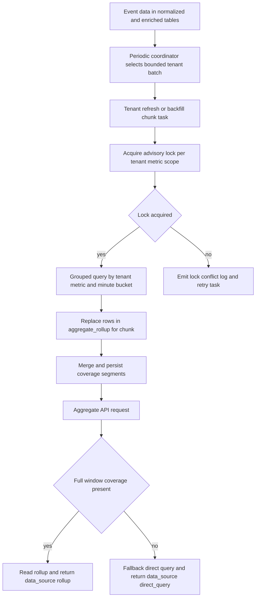

# Milestone 6: Aggregate Rollups and Materialized Summaries Plan

## 1. Milestone goal and rationale

Deliver a production-ready rollup layer that materializes aggregate summaries into dedicated tables, so dashboard endpoints can shift from expensive direct scans to bounded, indexed rollup reads while preserving correctness, tenant isolation, and response-contract stability.

Milestone 6 working increment:
- Add rollup persistence and coverage-segment metadata for tenant-scoped aggregate windows.
- Add Celery tasks for periodic refresh and historical backfill with explicit overlap-safe locking.
- Route aggregate endpoints to rollup-backed reads when full window coverage exists, with direct-query fallback when it does not.
- Keep endpoint contracts stable while making `data_source` explicit as `rollup` or `direct_query`.

Rationale from current baseline:
- Milestone 5 aggregates currently read directly from base event tables through [`AggregateService.count_events()`](src/event_platform/application/aggregate_service.py:33), [`AggregateService.top_event_types()`](src/event_platform/application/aggregate_service.py:66), and [`AggregateService.top_urls()`](src/event_platform/application/aggregate_service.py:94).
- Direct queries are correct but become costlier as tenant history grows and dashboard polling frequency increases.
- Orchestrator stretch direction already called out materialized rollups; this milestone operationalizes that direction with concrete implementation boundaries.

## 2. Assumptions and sequencing decisions

Assumptions used for this plan:
- User-directed pivot is accepted: Milestone 6 focuses on rollups and materialized summaries, while broader reliability and observability hardening shifts to Milestone 7.
- Existing aggregate API routes remain contract-compatible in [`src/event_platform/api/routes/aggregates.py`](src/event_platform/api/routes/aggregates.py:20).
- `unique-users` remains direct query in Milestone 6 because exact distinct users are non-additive across buckets without introducing approximate sketches.
- Rollups are minute-granularity in Milestone 6; multi-granularity compaction is deferred.

## 3. In scope and out of scope

### 3.1 In scope

- New rollup storage table and coverage-segment table via Alembic migration.
- Rollup computation services and repositories for:
  - total event count buckets
  - top event type buckets
  - top URL host buckets
- Scheduled periodic rollup rebuild for a recent lookback window.
- Historical backfill task to materialize old windows in bounded chunks.
- Aggregate read path update to prefer rollups when full coverage exists.
- Unit and integration test coverage for correctness parity, locking behavior, and fallback behavior.

### 3.2 Out of scope

- Replacing ingestion auth model in [`get_authenticated_tenant()`](src/event_platform/api/dependencies.py:24).
- Reworking Milestone 4 enrichment pipeline in [`enrich_event()`](src/event_platform/worker/tasks/enrichment.py:37).
- Implementing approximate distinct structures for `unique-users`.
- Full reliability and observability hardening program originally drafted for Milestone 6 in [`plans/orchestrator.md`](plans/orchestrator.md).

## 4. Baseline anchors and dependency context

Primary implementation anchors:
- Aggregate read routes: [`src/event_platform/api/routes/aggregates.py`](src/event_platform/api/routes/aggregates.py:20)
- Aggregate service: [`src/event_platform/application/aggregate_service.py`](src/event_platform/application/aggregate_service.py:30)
- Query validation patterns: [`QueryValidationError`](src/event_platform/application/query_service.py:17)
- Aggregate repository SQL patterns: [`EventRawRepository.count_events()`](src/event_platform/infrastructure/repositories/events_repo.py:173), [`EventRawRepository.top_event_types()`](src/event_platform/infrastructure/repositories/events_repo.py:210), [`EventRawRepository.top_urls()`](src/event_platform/infrastructure/repositories/events_repo.py:248)
- Existing schema/index baseline: [`src/event_platform/infrastructure/db/models.py`](src/event_platform/infrastructure/db/models.py:46), [`alembic/versions/20260306_0003_query_indexes.py`](alembic/versions/20260306_0003_query_indexes.py:19)
- Worker runtime baseline: [`src/event_platform/worker/celery_app.py`](src/event_platform/worker/celery_app.py:9), [`docker-compose.yml`](docker-compose.yml:28)

## 5. Data model changes

## 5.1 New table: `aggregate_rollup`

Purpose: materialized minute buckets for additive metrics.

Proposed columns:
- `id` UUID PK
- `tenant_id` UUID FK `tenant.id`
- `bucket_start` timestamptz not null
- `bucket_granularity` varchar not null, fixed value `minute` in Milestone 6
- `metric_name` varchar not null
  - `events.count`
  - `events.by_type`
  - `events.by_url_host`
- `dimension_key` varchar not null
  - `__all__` sentinel for `events.count`
  - canonical type for `events.by_type`
  - canonical URL host for `events.by_url_host`
- `metric_value` bigint not null
- `updated_at` timestamptz default `now()`

Constraints and indexes:
- Unique composite key: `(tenant_id, bucket_start, bucket_granularity, metric_name, dimension_key)`
- Check constraint enforcing sentinel policy:
  - `events.count` rows must use `dimension_key='__all__'`
  - non-count rows must not use `dimension_key='__all__'`
- Index `(tenant_id, metric_name, bucket_start)` for bounded window scans
- Index `(tenant_id, metric_name, bucket_start, dimension_key)` for top-N regroup queries

Design decision and implementation implication:
- Milestone 6 adopts a non-null sentinel strategy to remove nullable-unique duplicate risk. Repository rebuild code always writes one deterministic count row per bucket using `dimension_key='__all__'`.

## 5.2 New table: `aggregate_rollup_coverage_segment`

Purpose: represent materialized coverage as mergeable segments so non-contiguous backfills are valid and query routing stays correct.

Proposed columns:
- `id` UUID PK
- `tenant_id` UUID FK `tenant.id`
- `bucket_granularity` varchar not null
- `metric_group` varchar not null, value `core_dashboard`
- `segment_start` timestamptz not null
- `segment_end` timestamptz not null
- `updated_at` timestamptz default `now()`

Constraints and indexes:
- Check constraint: `segment_start < segment_end`
- Unique composite key: `(tenant_id, bucket_granularity, metric_group, segment_start, segment_end)`
- Index `(tenant_id, bucket_granularity, metric_group, segment_start, segment_end)`

Coverage semantics:
- Coverage is modeled as a set of disjoint half-open segments `[segment_start, segment_end)`.
- After each successful rebuild or backfill chunk commit, repository logic upserts and merges overlapping or adjacent segments into canonical disjoint segments.
- Aggregate reads can use rollup only when the entire normalized request window is fully covered by the segment union.
- If full coverage cannot be proven, read source is `direct_query` for the whole response.

## 6. API, service, repository, and infra changes

## 6.1 API surface and response contract confirmation

Endpoint paths stay unchanged:
- `GET /v1/aggregates/count`
- `GET /v1/aggregates/top-event-types`
- `GET /v1/aggregates/top-urls`
- `GET /v1/aggregates/unique-users`

Contract behavior:
- No breaking request changes.
- Response `data_source` remains present and backward-compatible across all aggregate endpoints.
- Allowed response values are stable:
  - `count`, `top-event-types`, `top-urls`: `rollup | direct_query`
  - `unique-users`: always `direct_query` in Milestone 6
- Payload shapes remain unchanged from Milestone 5 in [`src/event_platform/api/schemas/aggregates.py`](src/event_platform/api/schemas/aggregates.py:8).

Read-source decision contract:
- Aggregate service must return a single source per endpoint response.
- No mixed-source stitching inside one response.
- If request bounds are open-ended or coverage has any gap, source is `direct_query`.

## 6.2 Application service changes

Add new rollup application services:
- `RollupBuildService`
  - rebuild minute buckets for `(tenant_id, window_start, window_end)`
  - enforce count sentinel write policy for `events.count`
  - update merged coverage segments only after successful chunk commit
- `RollupReadService`
  - read count and top-N summaries from rollup table
  - evaluate full-window coverage from segment union

Refactor [`AggregateService`](src/event_platform/application/aggregate_service.py:30):
- Introduce `prefer_rollup` internal branch:
  - use rollup only when metric is supported, request is bounded, and full coverage exists
  - else fallback to existing direct repository methods
- Keep existing query validation flow and UTC normalization.
- Enforce `data_source` value contract consistently across all four aggregate endpoints.

Top-urls parity semantics with Milestone 5:
- Rollup build uses enriched canonical host only from [`EventEnriched.url_host`](src/event_platform/infrastructure/repositories/events_repo.py:261).
- Missing or empty host values are excluded from top-urls buckets.
- No synthetic `unknown` bucket and no fallback host derivation in Milestone 6.
- Rollup and direct-query results therefore share the same null and unknown handling behavior.

## 6.3 Repository changes

Extend infrastructure repositories with rollup-focused methods in [`src/event_platform/infrastructure/repositories/events_repo.py`](src/event_platform/infrastructure/repositories/events_repo.py:15) or a dedicated new repository module:
- `rebuild_rollup_window_for_tenant`
- `upsert_rollup_rows`
- `delete_rollup_window`
- `get_rollup_count`
- `get_rollup_top_dimensions`
- `list_coverage_segments`
- `merge_coverage_segment`
- `is_window_fully_covered`

SQL shape for rebuild:
- Single grouped query over [`event_normalized`](src/event_platform/infrastructure/db/models.py:96), joined with [`event_enriched`](src/event_platform/infrastructure/db/models.py:157) where needed.
- `date_trunc minute` bucketing by `occurred_at_utc`.
- Replace-within-window strategy for idempotency:
  - delete existing rollup rows for tenant and window
  - insert grouped rows for same window in one transaction
- Count metric rows use deterministic sentinel `dimension_key='__all__'`.
- Top URL rows include only non-null non-empty canonical hosts.

## 6.4 Worker and scheduling changes

Add rollup task module:
- `src/event_platform/worker/tasks/rollups.py`

Tasks:
- `refresh_recent_rollups`
  - periodic coordinator task
  - fetches active tenants in bounded batches
  - dispatches tenant-scoped refresh subtasks
- `refresh_recent_rollups_for_tenant`
  - rebuilds trailing lookback window for one tenant
  - acquires overlap-safe advisory lock before rebuild
- `backfill_rollups`
  - ad-hoc task
  - rebuilds historical windows in chunks per tenant
  - acquires same advisory lock policy as refresh

Concurrency control decision:
- Use DB advisory lock per `(tenant_id, metric_group, bucket_granularity)` to serialize refresh and backfill for the same tenant-metric scope.
- Lock acquisition uses non-blocking try-lock semantics.
- If lock is unavailable, task is treated as retryable contention:
  - emit structured `rollup_lock_conflict` log
  - requeue with bounded retry policy and jitter
  - no partial write occurs before lock acquisition

Per-tenant fan-out and bounded batching:
- Periodic coordinator dispatches at most `aggregate_rollup_refresh_tenants_per_tick` tenants per run.
- Tenant enumeration is deterministic and paged to avoid unbounded scheduler work.
- Worker queue concurrency is capped by `aggregate_rollup_refresh_max_inflight_tenant_tasks`.
- Backfill is chunked by `aggregate_rollup_backfill_chunk_minutes` and capped by `aggregate_rollup_backfill_max_chunks_per_task`.

Celery wiring updates:
- include rollup task module in [`celery_app`](src/event_platform/worker/celery_app.py:9)
- configure periodic schedule for `refresh_recent_rollups`
- add beat process in [`docker-compose.yml`](docker-compose.yml:1) as `worker_beat`

## 6.5 Configuration changes

Extend [`Settings`](src/event_platform/core/config.py:8) with:
- `aggregate_rollup_enabled` bool default `false`
- `aggregate_rollup_refresh_lookback_minutes` int default `180`
- `aggregate_rollup_refresh_interval_seconds` int default `60`
- `aggregate_rollup_refresh_tenants_per_tick` int default `100`
- `aggregate_rollup_refresh_max_inflight_tenant_tasks` int default `20`
- `aggregate_rollup_backfill_chunk_minutes` int default `1440`
- `aggregate_rollup_backfill_max_chunks_per_task` int default `24`
- `aggregate_rollup_lock_retry_max_attempts` int default `8`
- `aggregate_rollup_lock_retry_base_seconds` int default `5`
- `aggregate_rollup_max_window_minutes` int guardrail for API rollup reads

## 7. Step-by-step implementation plan ordered by dependency

### Phase 1: Schema and migration foundation

Scope:
- Add new SQLAlchemy models for `aggregate_rollup` and `aggregate_rollup_coverage_segment` in [`src/event_platform/infrastructure/db/models.py`](src/event_platform/infrastructure/db/models.py:15).
- Add Alembic migration revision after [`20260306_0003`](alembic/versions/20260306_0003_query_indexes.py:13).
- Include sentinel check constraints and segment table constraints.

Checkpoint gate:
- Migration up and down works with clean index and constraint creation.

Verification:
- `alembic upgrade head`
- `alembic downgrade -1`
- `alembic upgrade head`

### Phase 2: Rollup repository and grouped query engine

Scope:
- Implement grouped aggregate SQL for minute buckets.
- Implement replace-window writes with count-sentinel policy.
- Implement coverage segment merge and full-window coverage checks.

Checkpoint gate:
- Rebuild for a seeded window writes deterministic bucket rows and canonical coverage segments.

Verification:
- `pytest -q tests/integration/test_repositories.py -k rollup`

### Phase 3: Rollup build and read services

Scope:
- Add application services for rebuild and read.
- Add bounded-window coverage checks and normalization utilities.
- Add read-source routing contract enforcement for all aggregate endpoints.

Checkpoint gate:
- Service layer returns valid rollup results for count and top-N from seeded fixtures and falls back correctly on any gap.

Verification:
- `pytest -q tests/unit/test_rollup_coverage.py tests/unit/test_aggregate_source_selection.py`

### Phase 4: Worker tasks, lock safety, and periodic scheduling

Scope:
- Implement tenant fan-out coordinator and tenant-scoped refresh tasks.
- Implement lock conflict retry behavior for refresh and backfill overlap.
- Wire periodic schedule and add beat process to Compose.

Checkpoint gate:
- Local stack runs API, worker, and beat; periodic task produces rollup rows without overlapping-tenant write races.

Verification:
- `docker compose up -d --build`
- `docker compose logs worker --tail=200`
- `docker compose logs worker_beat --tail=200`
- `pytest -q tests/integration/test_rollup_tasks.py -k lock`

### Phase 5: Aggregate API dual-source routing

Scope:
- Refactor aggregate service to use rollup where full coverage exists.
- Keep direct-query fallback for uncovered windows and `unique-users`.
- Preserve route contracts in [`src/event_platform/api/routes/aggregates.py`](src/event_platform/api/routes/aggregates.py:31).
- Confirm `data_source` value behavior remains backward-compatible.

Checkpoint gate:
- Endpoints return source-aware payloads with correct metric values and stable response schema.

Verification:
- `pytest -q tests/integration/test_aggregates_api.py -k data_source`

### Phase 6: Historical backfill and parity validation

Scope:
- Run backfill task over seeded historical data with non-contiguous windows.
- Validate rollup parity versus direct query for supported metrics.
- Validate top-urls parity for missing enrichment host behavior.

Checkpoint gate:
- Parity assertions pass for `count`, `top-event-types`, `top-urls` across representative covered and uncovered windows.

Verification:
- `pytest -q tests/integration -k aggregate_parity`

## 8. Testing strategy

## 8.1 Unit tests layout and scope

Current baseline is integration-heavy under [`tests/integration`](tests/integration).

Milestone 6 introduces a new unit test package:
- `tests/unit/__init__.py`
- `tests/unit/test_rollup_windowing.py`
- `tests/unit/test_rollup_coverage.py`
- `tests/unit/test_aggregate_source_selection.py`
- `tests/unit/test_rollup_dimension_policy.py`

Unit scope:
- Bucket boundary normalization and window splitting.
- Coverage segment merge and full-window inclusion logic.
- Aggregate source selection branch in [`AggregateService`](src/event_platform/application/aggregate_service.py:30).
- Count sentinel and top-urls dimension normalization rules.

## 8.2 Integration tests

Keep primary end-to-end validation in existing integration suite:
- Extend [`tests/integration/test_repositories.py`](tests/integration/test_repositories.py) for rollup rebuild, segment merge, and idempotency.
- Extend [`tests/integration/test_aggregates_api.py`](tests/integration/test_aggregates_api.py) for:
  - `data_source` contract on all aggregate endpoints
  - covered windows using `data_source=rollup`
  - uncovered windows using `data_source=direct_query`
  - `unique-users` always `direct_query`
  - top-urls parity with null or empty host exclusion
- Add [`tests/integration/test_rollup_tasks.py`](tests/integration/test_rollup_tasks.py) for fan-out and lock contention retry behavior.
- Keep migration smoke checks in [`tests/integration/test_migration_smoke.py`](tests/integration/test_migration_smoke.py).

## 8.3 Non-functional correctness checks

- Idempotency: rerunning rebuild on same window produces identical final rows.
- Boundedness: rebuild and reads enforce max window constraints.
- Determinism: top-N ordering stable on equal counts using secondary key ordering.
- Concurrency safety: overlapping refresh and backfill attempts for same tenant-metric scope serialize via advisory lock and retry.

## 9. Observability and operations considerations

Rollup-specific observability included in Milestone 6:
- Structured logs:
  - `rollup_refresh_started`
  - `rollup_refresh_completed`
  - `rollup_backfill_chunk_completed`
  - `rollup_refresh_failed`
  - `rollup_lock_conflict`
- Required log keys: `tenant_id`, `window_start`, `window_end`, `bucket_granularity`, `rows_written`, `duration_ms`, `task_id`.

Rollup metrics:
- `rollup_refresh_runs_total`
- `rollup_refresh_failures_total`
- `rollup_rows_materialized_total`
- `rollup_refresh_duration_ms`
- `rollup_coverage_lag_seconds`
- `rollup_lock_conflicts_total`

Operational notes:
- Rollup reads stay behind `aggregate_rollup_enabled` until parity checks are complete.
- Backfill runs in bounded chunks to avoid long transactions.
- Coverage segment updates occur only after successful chunk commit.

Rollback and disable runbook after partial rollout:
1. Set `aggregate_rollup_enabled=false` in runtime config.
2. Restart API processes so read routing immediately returns to direct-query only.
3. Optionally pause rollup beat schedule to stop further refresh dispatch.
4. Allow in-flight rollup worker tasks to complete or stop workers gracefully; either path is safe because reads no longer consume rollups.
5. Validate with aggregate API smoke checks that `data_source=direct_query` across all endpoints.
6. Keep rollup tables intact for later re-enable; no emergency schema rollback required.

## 10. Risks and mitigations

| Risk | Impact | Mitigation |
| --- | --- | --- |
| Count metric duplicate rows due to nullable unique key behavior | Incorrect totals and non-idempotent rebuilds | Enforce non-null sentinel `dimension_key='__all__'` plus check constraints and deterministic repository writes |
| Non-contiguous backfill invalidates single-range watermark assumptions | Incorrect source routing for partially covered windows | Use coverage segments and full-window union checks before rollup reads |
| Refresh and backfill overlap on same tenant | Write races and unstable coverage metadata | Serialize with advisory lock per tenant-metric scope and retry on conflict |
| Backfill chunks create heavy DB load | API latency and lock contention | Use chunk-size config, per-tenant fan-out caps, inflight task limits, and off-peak runbook guidance |
| Top-urls parity drift on missing enrichment values | Inconsistent dashboard values across sources | Exclude null and empty hosts in both direct and rollup paths with explicit parity tests |
| Rollup feature rollout without safe toggle | Production risk in early validation | Keep `aggregate_rollup_enabled` default false and define explicit disable runbook |

## 11. Acceptance criteria and definition of done

Milestone 6 is complete when all conditions below are true:
- `aggregate_rollup` and `aggregate_rollup_coverage_segment` schema artifacts exist with migrations and downgrade support.
- Count metric sentinel policy is enforced by schema constraints and repository behavior.
- Periodic and backfill tasks populate rollup rows for seeded windows with deterministic outputs.
- Overlapping refresh and backfill work is serialized per tenant-metric scope with retry behavior validated by tests.
- Aggregate endpoints `count`, `top-event-types`, and `top-urls` read from rollups only when full coverage exists, and fallback when not.
- Endpoint responses keep stable schema and correctly signal `data_source=rollup` or `data_source=direct_query`.
- `unique-users` remains correct and unchanged on direct query.
- Top-urls parity for missing enrichment hosts matches direct-query behavior.
- Unit and integration suites pass using the defined `tests/unit` and `tests/integration` layout.
- Rollup logs, metrics, and rollback runbook provide enough operational safety for controlled rollout.

## 12. Rollup flow diagram

